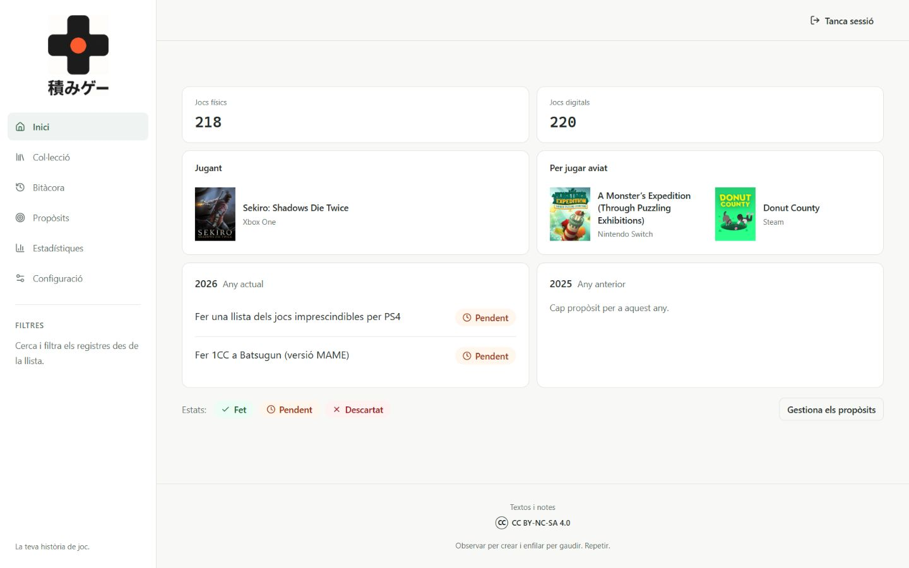
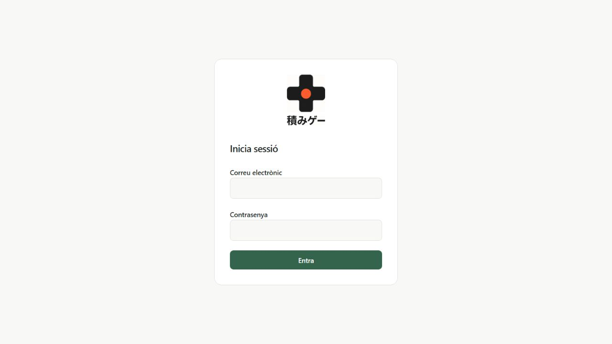

# 積みゲー · Tsumigē

**Una col·lecció de videojocs i una bitàcora personal, en un mateix lloc.**

Tsumigē neix per consultar una col·lecció física i digital. També permet recordar què s’ha jugat al llarg dels anys, valorar els jocs, escriure comentaris i seguir els propòsits de cada any. La interfície és en català i busca una presentació clara, discreta i fàcil de consultar.

[Obre l’aplicació](https://ibelchi.github.io/Tsumige/) · [Blog de l’autor](https://ibelchi.github.io/)

## Què permet fer?

- **Inici:** recompte de jocs físics i digitals, portades dels jocs que s’estan jugant o es volen jugar aviat, tres portades aleatòries de la col·lecció i propòsits de l’any actual.
- **Col·lecció:** consulta en llista o fitxes amb portada; filtres de plataforma, format i gènere; cerca i navegació d’un registre al següent.
- **Bitàcora:** jocs agrupats per any, encara que no siguin a la col·lecció. Un joc pot tenir entrades de diversos anys.
- **Valoracions i comentaris:** una valoració i un camp de comentaris per joc. A+ i A++ destaquen en vermell; una valoració en blanc és vàlida.
- **Propòsits:** pendents, fets o descartats, identificats amb text i color.
- **Estadístiques:** plataformes, gèneres, compres per any, jocs jugats i valoracions. Les categories enllaçades obren els registres corresponents.
- **Portades:** consulta manual d’IGDB i RAWG o introducció d’una URL.
- **Còpies de seguretat:** ZIP amb dades i fitxers de les portades, vinculacions i informe d’errors; exportacions CSV per consultar amb Excel.
- **Accés de convidats:** consulta sense poder modificar les dades, protegida també a la base de dades.
- **Recuperació:** enllaç per correu per canviar la contrasenya, i restauració de còpies ZIP amb revisió prèvia i portades guardades a Supabase.

## Captures

### Inici



### Accés



## Codi públic, dades personals protegides

Aquest repositori conté el programa i la documentació. **No conté la base de dades personal**, els lots d’importació, contrasenyes ni còpies de seguretat. L’aplicació consulta Supabase després d’iniciar sessió; els permisos del propietari i dels convidats s’apliquen amb polítiques de seguretat a la base de dades (RLS).

Les captures mostren una part de la interfície; no donen accés a les dades. La URL i la clau *publishable* de Supabase són configuració pública del client. Les claus secretes i les credencials d’IGDB/Twitch i RAWG es mantenen al servidor.

## Tecnologia

React, TypeScript, Vite, Tailwind CSS, TanStack Query i Supabase. GitHub Actions compila i publica a GitHub Pages en cada pujada a `main`. El blog enllaça aquesta publicació independent.

## Desenvolupament local

Requereix Node.js 22. Copia `.env.example` a `.env.local` i indica la URL i la clau pública del teu projecte Supabase.

```sh
npm ci
npm run dev
```

La base de dades requereix l’esquema, les funcions i les polítiques descrits a [Arquitectura](docs/ARQUITECTURA.md). Crear només un projecte buit a Supabase no és suficient per executar totes les funcionalitats. Aquest repositori encara no ofereix un instal·lador de base de dades per a tercers.

```sh
npm run typecheck
npm run lint
node --experimental-strip-types --test tests/backup-archive.test.ts tests/recovery-restore.test.ts
npm run build
```

Consulta [Publicació i manteniment](docs/PUBLICACIO.md) per al circuit de canvis i [Treball pendent](docs/PENDENTS.md) per a les limitacions i properes millores.

## Autoria i drets

Projecte d’[Israel Belchi](https://github.com/ibelchi).

Els textos i notes propis de l’autor es comparteixen amb **CC BY-NC-SA 4.0**. Aquesta llicència no s’aplica al codi, als logotips ni a les portades de tercers. No s’ha escollit encara una llicència per al codi; les dependències mantenen les seves llicències respectives.

*Observar per crear i enfilar per gaudir. Repetir.*
